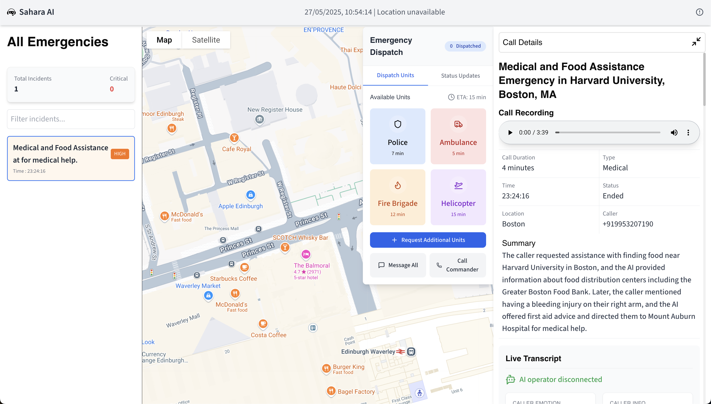

# Sahara AI – Emergency Response Dashboard

**Sahara AI** is an AI-powered emergency response dashboard designed to revolutionize how emergency calls are managed, analyzed, and dispatched. Built for hackathons and real-world impact, Sahara AI leverages intelligent automation and serverless workflows to bridge the gap in critical moments—when every second counts.

---

## 🚨 Problem

Emergency call centers are overwhelmed and understaffed, leading to:
- Delayed response times
- Overworked operators
- Increased risk of critical errors

**Sahara AI** addresses these challenges with a modern, data-driven, and AI-augmented solution powered by serverless infrastructure.

---

## ✨ Features

- **Live Emergency Dashboard:**  
  Visualize all active emergency calls and their locations on an interactive map.

- **AI-Powered Call Analysis:**  
  Each call is analyzed in real-time for severity, category, risk, and recommended actions using advanced AI through Buildship workflows.

- **Serverless AI Processing:**  
  Leverages Buildship's serverless platform for scalable, cost-effective emergency call analysis.

- **Incident Management:**  
  View, filter, and interact with incidents directly on the dashboard.

- **Live Transcript & Emotion Detection:**  
  See live transcripts of emergency calls and real-time caller emotion analysis.

- **Automated Dispatch:**  
  Instantly triage and dispatch resources based on AI recommendations.

- **Modern UI:**  
  Responsive, accessible, and visually engaging interface built with Next.js and Tailwind CSS.

---

## 🖥️ Screenshots



---

## 🏗️ Architecture

Sahara AI uses a hybrid architecture combining VAPI for call management and Buildship for AI processing:

1. **VAPI Integration:** Handles incoming emergency calls and provides call data
2. **Buildship Workflow:** Processes call data through serverless AI analysis
3. **Frontend Dashboard:** Displays real-time analysis and emergency response interface

### Buildship Workflow

Our serverless workflow includes:
- **REST API Trigger:** Receives emergency call data
- **OpenAI Assistant:** Analyzes call severity, category, and emotions
- **Location Extraction:** Identifies emergency location from call transcripts
- **Structured Response:** Returns formatted analysis for dashboard display

---

## 🚀 Getting Started

### Prerequisites

- Node.js (v18+ recommended)
- npm or yarn
- Google Maps API Key (for map features)
- VAPI API credentials
- Buildship account and workflow endpoint

### Installation

1. **Clone the repository:**
   ```bash
   git clone https://github.com/anuj846k/sahara-ai.git
   cd sahara-ai/frontend
   ```

2. **Install dependencies:**
   ```bash
   npm install
   # or
   yarn install
   ```

3. **Set up environment variables:**
   - Create a `.env.local` file in the `frontend` directory.
   - Add your API keys and endpoints:
     ```
     NEXT_PUBLIC_GOOGLE_MAPS_API_KEY=your_google_maps_api_key
     VAPI_WEB_TOKEN=your_vapi_token
     VAPI_ASSISTANT_ID=your_vapi_assistant_id
     NEXT_PUBLIC_GEMINI_API_KEY=your_gemini_api_key
     NEXT_PUBLIC_BUILDSHIP_ENDPOINT=https://api.buildship.run/v1/triggers/your-workflow-id
     ```

4. **Set up Buildship Workflow:**
   - Sign up at [buildship.com](https://buildship.com)
   - Import or create the emergency analysis workflow
   - Configure OpenAI API key in Buildship environment variables
   - Deploy the workflow and copy the endpoint URL

5. **Run the development server:**
   ```bash
   npm run dev
   # or
   yarn dev
   ```

6. **Open your browser:**  
   Visit [http://localhost:3000](http://localhost:3000) to view the dashboard.

---

## 🗺️ Project Structure

```